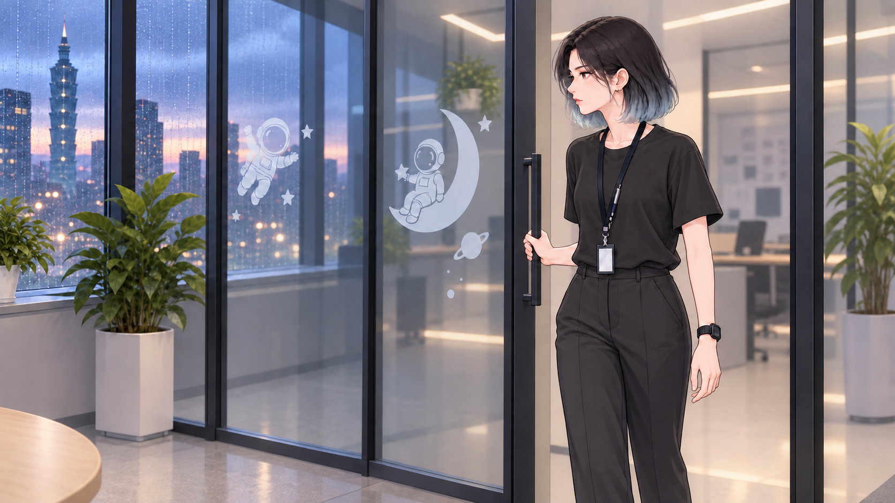
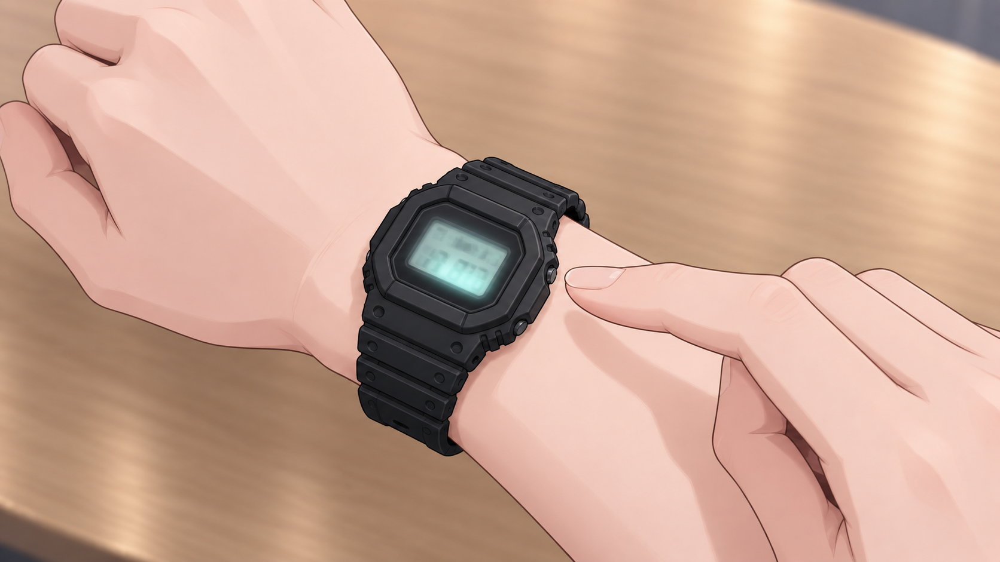

# 既有關鍵影格 v3 重新審查

00–04 共 13 張已於 2026-09-27 依最新劇情逐張重看。正式判定見下表；後方各圖的舊版「待使用者驗收」標題只保留生成歷史，不再代表 v3 狀態。v3 規格見 [目前分鏡表](../../../../../property/cutscene-storyboard-v3.md)。

| 影格 | v3 狀態 | 判定 |
| --- | --- | --- |
| 00-A | 沿用 | 雨澄不知情地工作，錶與空間正確 |
| 00-B | **重繪** | 藍色物件像平板，沒有紙頁厚度 |
| 00-C | 沿用 | 予安視線與人物距離成立 |
| 01-A、01-B | 退出 | 01 影片退役；runtime 已演打字／刪除 |
| 02-A | 沿用 | 入室起點中立 |
| 02-B | 退出 | 固定反應會壓平三條邀請分支 |
| 02-C | 沿用 | 三角座位、三杯水與 HR 平板成立 |
| 03-A、03-B | 退出 | 03 影片退役；與 s6 CG／動作重複 |
| 04-A | 退出 | 肢體已修正合格，但按錶節拍不再放進影片 |
| 04-B、04-C | 沿用構圖 | 改解讀為問題說完後的等待與沉默 |

本頁顯示目前選定版本，淘汰生成稿留在工具原始輸出位置，不放入此目錄。整批共約 24 MB，請勿直接隨遊戲 ZIP 出貨；排除建置由 Claude 處理。

## v3 驗收關注點

沿用不等於影片已核准；只有 00-A、00-C、02-A、02-C、04-B、04-C 可進下一輪。00-B 必須先重繪；其餘退出影格不得再排入 runtime storyboard。原圖為 1672×941，精確 16:9 仍是影片交付條件。

## 00-A — 待使用者驗收

雨澄專注工作、左腕數位錶、筆與識別證分開；待使用者確認。

原生 PNG：1672×941；2004434 bytes。SHA-256：6377f9670be8fd8dc50ed8c8c2193d0cd3a4550cc90551fa01b12146780e31e5。

## 00-B — 待使用者驗收

雅琳淺色外觀、雙手持夾且尚未放下；資料夾頂面因角度不可見，不要求可讀姓名。

原生 PNG：1672×941；2075828 bytes。SHA-256：14453be6f7babb84eb7d63872024299b0fdef051075c3f57b2179206661468f7。

## 00-C — 待使用者驗收

予安與遠處工作的雨澄分離、未通知；保留距離。

原生 PNG：1672×941；2002478 bytes。SHA-256：20841c56298839283b5f2cb4d13c3593179f3137d4b65fdf060fe51e18f8188e。

## 01-A — 待使用者驗收

草稿仍在輸入框、手指停退格鍵前；畫面文字為抽象線條。

原生 PNG：1672×941；1620304 bytes。SHA-256：fcadc62981fd55e49d0925e7661008f3aa5579ed5198eea36c57f58feaef952d。

## 01-B — 待使用者驗收

予安朝螢幕、雨澄仍不知情；無通知。

原生 PNG：1672×941；2031185 bytes。SHA-256：c8df356843644e79731d8c67f38f0fc5b3e84380813a8594a31c67b6c79f8759。

## 02-A — 待使用者驗收

雨澄手留門把、空手入室；已修除前景多餘空椅。

原生 PNG：1672×941；1784674 bytes。SHA-256：2c87e33864b52d708ef03d5a6badae086eb122c774272ee9b1c4cf6a41a6abd7。

## 02-B — 待使用者驗收

藍夾不可讀姓名標示、雨澄只看不碰；未演放筆。

原生 PNG：1672×941；1882425 bytes。SHA-256：816357570da0efa16e2d0086c684b5a1056bcca72daf49c8072dc3bf12b624f3。

## 02-C — 待使用者驗收

三人三側、三杯水、HR 平板；已修畫面破損、補頂面姓名標示並降低 HR 水位。

原生 PNG：1672×941；1886163 bytes。SHA-256：05224e88c2e25b00698e5d1749a638d7b81e016f11aa7fdccfc27384b4197458。

## 03-A — 待使用者驗收

雅琳手在閉合文件夾外緣；已修薄夾及頂面標示。左緣仍有少量椅背，未露第四人；後續連戲需留意裁切。

原生 PNG：1672×941；1843816 bytes。SHA-256：70ce29ec727744242f35ba57c920453994e83da3538673028f48294dfc9fa50b。

## 03-B — 待使用者驗收

雨澄看左腕矩形錶，雙手空著、畫面無筆與簽名區。

原生 PNG：1672×941；1893316 bytes。SHA-256：e848e84b386c455961c83c21d3e5a8ae093ce7604a053b3b85f2545173aca611。

## 04-A — 已修正肢體結構，待遊戲整合

左腕矩形數位錶亮起，右手從自然方向靠近錶殼側鍵，食指停在可實際按壓的位置；左右手腕、前臂與手指關節均符合人體結構。錶面刻意模糊，沒有可讀時間。

原生 PNG：1672×941；1471509 bytes。SHA-256：e8ded6a5e95518523a7a54c30cc83ea7aa8e5a15ada3eda8a39429e9767dcc82。2026-09-26 以原圖為編修目標重製，只修正物理上不合理的手部與手腕姿勢；矩形左腕數位錶、桌面、構圖、背光與同段畫風均保留。

## 04-B — 待使用者驗收

雨澄穩定朝左看予安、準備提問；沒有演出答案。

原生 PNG：1672×941；1767624 bytes。SHA-256：0e28bd2ba585fdf40af353dfaafe0d3d602f57c60142fc4c161bfb17e0bc2356。

## 04-C — 待使用者驗收

予安沉默朝右、雅琳手停在平板鍵盤；無回答。平板由前段平放至此架起，動作發生於鏡外程序說明期間。

原生 PNG：1672×941；1926455 bytes。SHA-256：d08c7081ef335d9916adea7e34e5bef1a2d854a91787af5fc3e7634f5b88d7ff。
